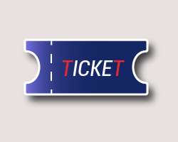

# _Proyecto Ingregador en ICARO: MarketPlace_
---
### Temática del MarketPlace:
Éste e-commerce está pensado para comercializar **productos turísticos**: excursiones, traslados, boletos a museos, entre otros.

### Historia del proyecto:
**Tourtickets** tiene la finalidad de conectar a visitantes de un destino turístico, con los operadores turísticos de dicho destino.
En principio se desarrollará pensansando en utilizarlo en un "único" destino, intentando estructurarlo para poder escalar sus funcionalidades a más de un destino turístico.

__*Algunos productos turísticos que se podrán comercializar en éste MarketPlace*__

1. Excursiones:
    - Glaciar Perito Moreno
    - Minitrekking
    - Glaciares Gourmet
    - Todo Glaciares
    - Perito Moreno Kayak Experience
    - Tour Alternativo a Glaciar Perito Moreno
    - Balcones de Calafate
    - Nativo Experience
    - Mayo Spirit Trek
    - Big Ice
    - Estancia 25 de Mayo

2. Traslados:
    - IN Aeropuerto
    - OUT Aeropuerto

3. Boletos de ingreso:
    - Bar de Hielo
    - Museo Glaciarium

> Éstos son solo algunos de los servicios que se podrán comercializar y para los que está pensado éste proyecto.

### Público objetivo:
El público objetivo de éste e-commerce son hombres y mujeres, de 18 años en adelante que estén pensando en viajar a la Patagonia Argentina y quieran contratar su tour de forma online, por lo general, con anticipación.

### Elementos de diseño elegidos para éste proyecto:
---
## Tipografías:

# Principal y variantes:

*Nombre de la tipografía:* Roboto
*Variaciones elegidas:* Thin 100, Light 300, Light 300 Italic, Regular 400, Medium 500 y por ultimo Bold 700.

_Puedes ver el recurso en:_ [Recurso](https://fonts.google.com/specimen/Roboto)

## Paleta de Colores:

# Principal y variantes:

*Colores principales:* 
    - Royal Blue Dark: #152664
    - Medium Purple: #8b80f9

*Colores secundarios:*
    - Opcion clara (Platinum): #e7e1e1
    - Opcion oscura (Rich Black FOGRA 29): #01161e

*Colores llamada a la acción, alertas:*
    - Rose Madder: #df2935

Herramienta utilizada para generar paleta de colores: [Coolors](https://coolors.co/)

## Logotipo creado para éste proyecto:

